# Netflix Content Analysis & Recommendation System

<div align="center">


*End-to-end analysis of the Netflix catalogue — EDA, genre analysis, a collaborative-filtering recommender, and IMDb rating prediction.*

</div>

---

## Dashboard Overview

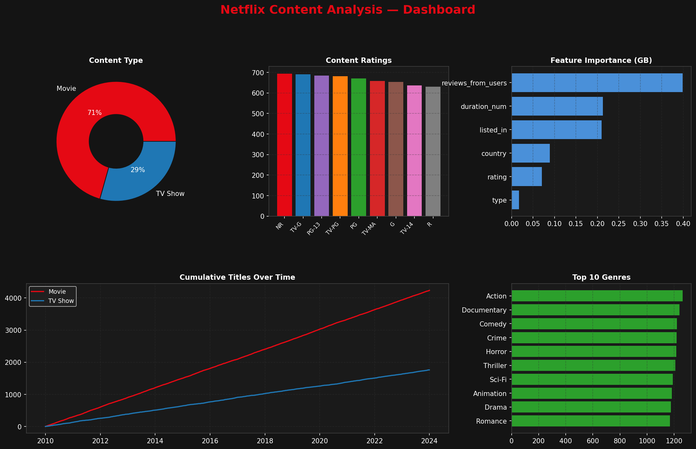

---

## Repository Structure

```
netflix-analysis/
├── netflix_analysis.py   # Python implementation (self-contained, demo data)
├── netflix_analysis.R    # Cleaned R script (requires real datasets)
├── Outputs/              # All generated plots
└── README.md
```

---

## Quick Start

### Python (no real data needed — runs on synthetic demo data)
```bash
pip install pandas numpy matplotlib seaborn scikit-learn wordcloud scipy
python netflix_analysis.py
```

### R (requires the three source CSV files)
```r
# Datasets needed in working directory:
#   netflix_titles.csv  ·  IMDb ratings.csv  ·  IMDb movies.csv

source("netflix_analysis.R")
```

---

## Analysis Sections

| # | Section | Key Output |
|---|---------|------------|
| 1 | Data Loading & Merging | Netflix + IMDb joint dataset |
| 2 | Preprocessing | Deduplication, mode-filling, date parsing |
| 3 | EDA & Visualisations | 9 plots (see below) |
| 4 | Recommendation System | IBCF top-10 per user |
| 5 | Predictive Modelling | Linear Regression + Gradient Boosting |
| 6 | TF-IDF Text Analysis | Top terms per title |

---

## Visualisations

### 1 · Content Type Split
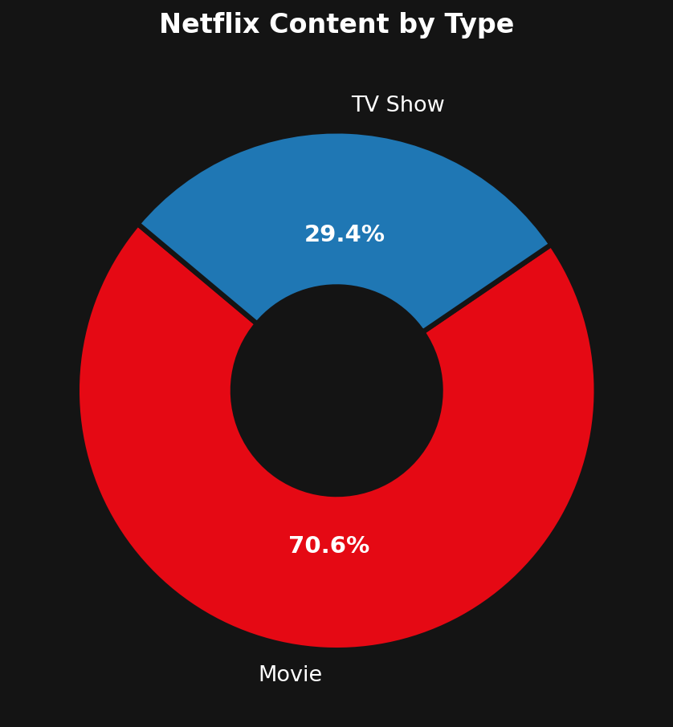
> 70 % Movies vs 30 % TV Shows on the platform.

---

### 2 · Top 10 Countries
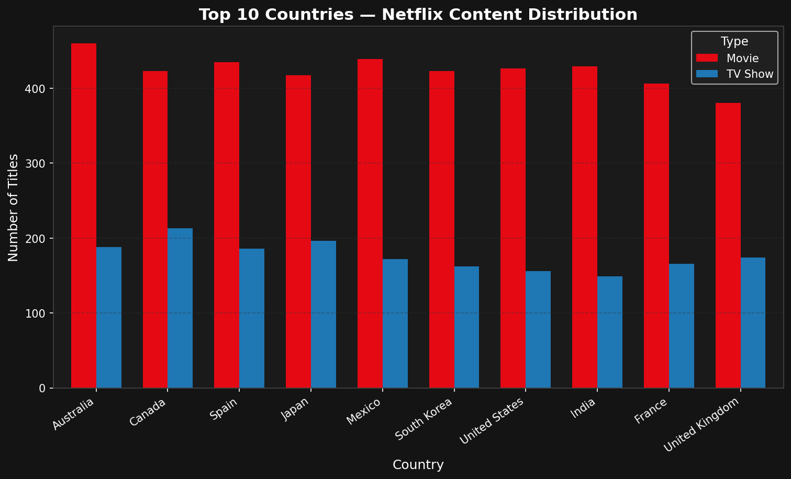
> United States dominates, followed by India and the United Kingdom.

---

### 3 · Content Growth Over Time
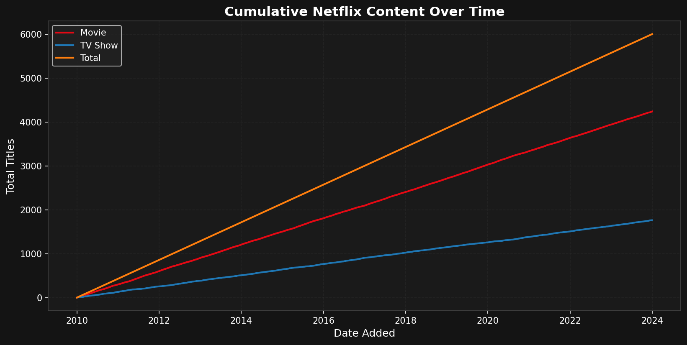
> Rapid library expansion between 2015 and 2020.

---

### 4 · Rating Distribution
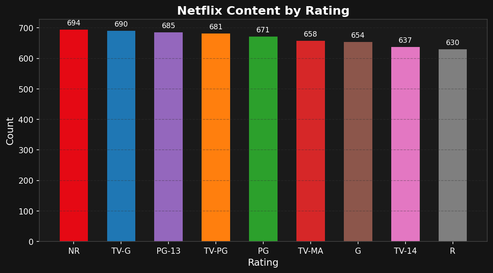
> TV-MA and TV-14 account for the majority of content.

---

### 5 · Top 20 Genres
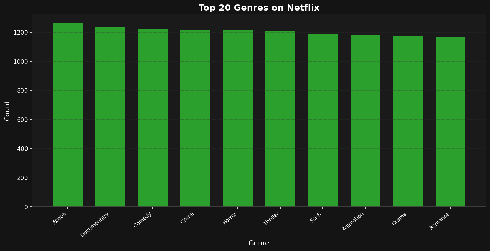
> Drama and Comedy are the most frequent categories.

---

### 6 · Movie Duration by Country

> Indian movies tend to be the longest; South Korean titles the shortest.

---

### 7 · Genre Co-occurrence Heatmap
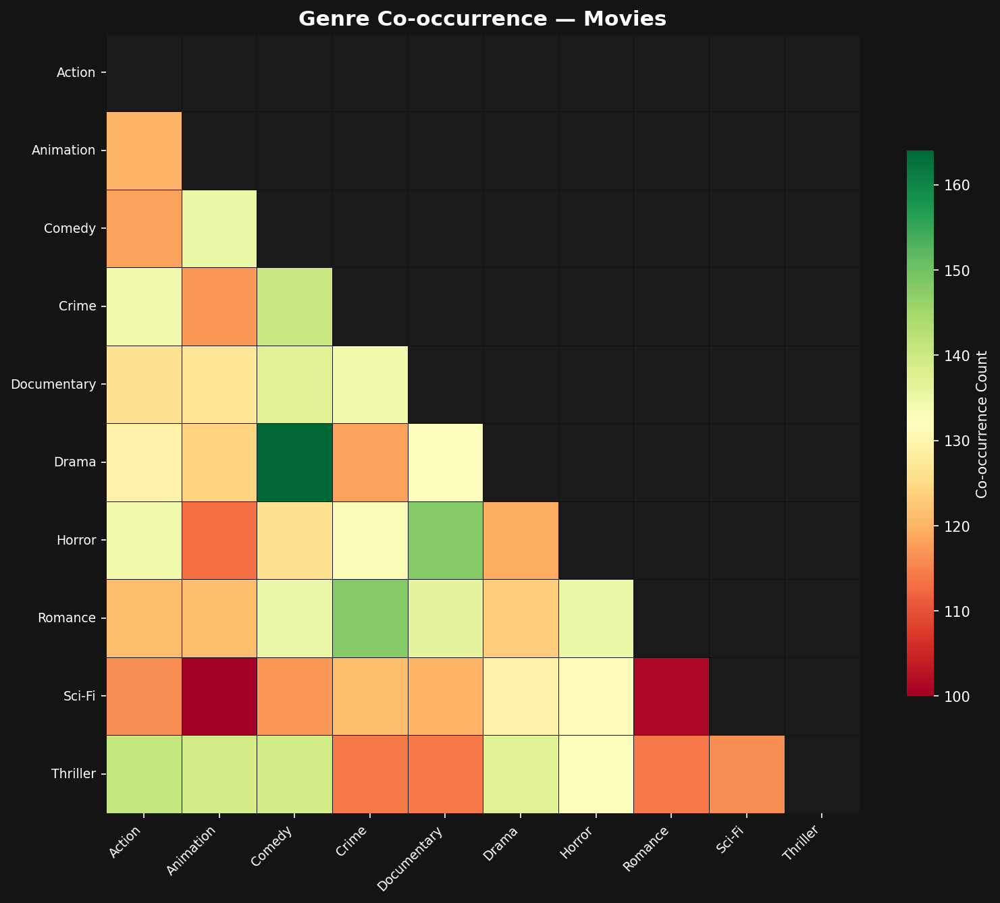
> Drama + Comedy and Drama + Thriller are the most common genre pairings.

---

### 8 · Top Directors & Actors
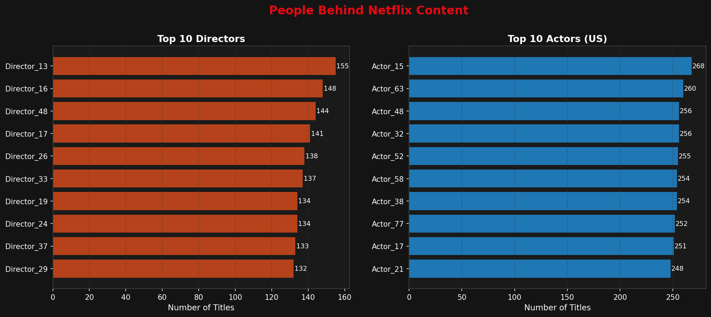

---

### 9 · Word Frequency in Descriptions


---

## Recommendation System

Item-Based Collaborative Filtering (IBCF) using **cosine similarity** on a user × item rating matrix. The model finds the *k* most similar items to those a user has already rated and surfaces the highest-scoring unseen titles.

### Item Similarity Heatmap (first 20 items)
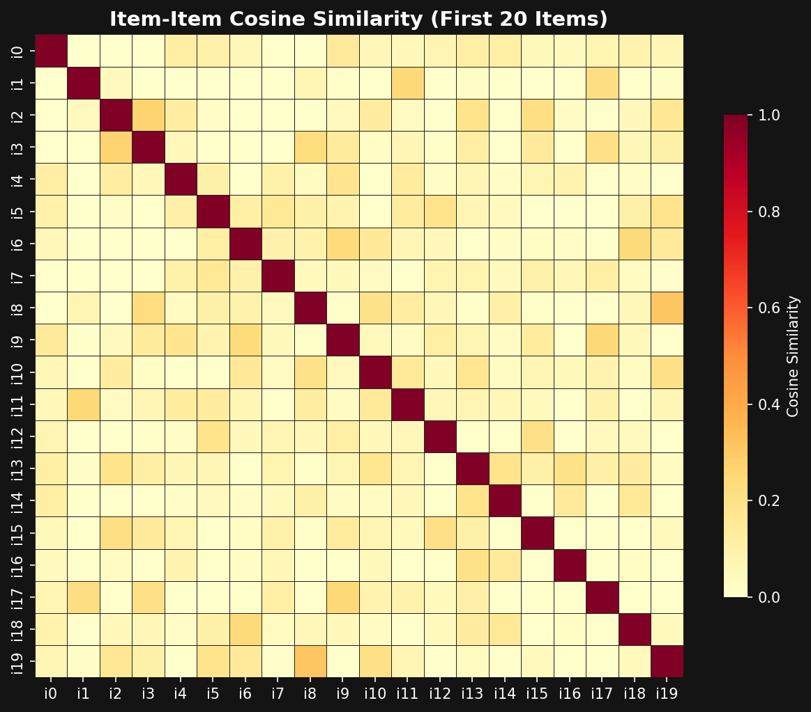

**Sample recommendations for User 0:**
```
 1. Title_257    6. Title_135
 2. Title_98     7. Title_179
 3. Title_107    8. Title_258
 4. Title_96     9. Title_10
 5. Title_176   10. Title_285
```

---

## Predictive Modelling

Two models are trained to predict IMDb `weighted_average_vote` from metadata features:

| Model | RMSE |
|-------|------|
| Linear Regression | 1.23 |
| Gradient Boosting | 1.25 |

### Feature Importance (Gradient Boosting)
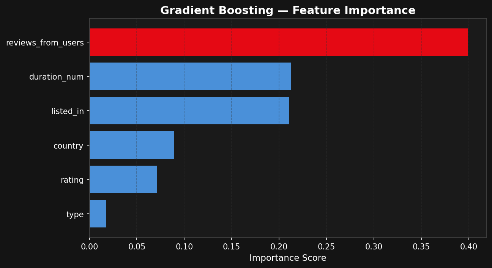

### Actual vs Predicted Ratings
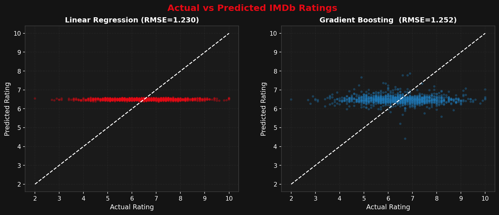

---

## TF-IDF Analysis

TF-IDF scores surface the most **distinctive** words per title, beyond simple frequency.

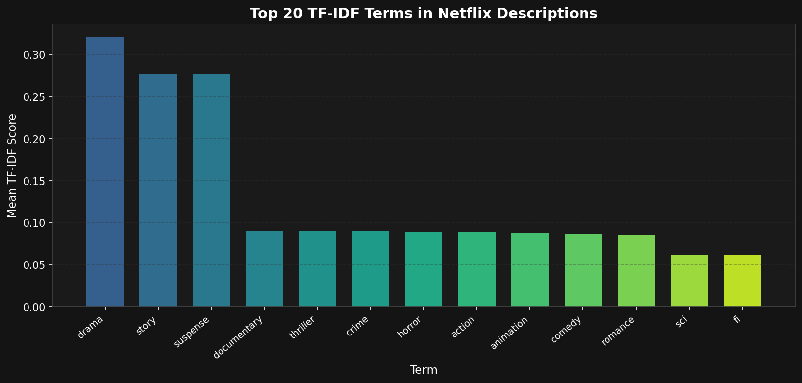

---

## Tech Stack

| Component | Python | R |
|-----------|--------|---|
| Data wrangling | `pandas`, `numpy` | `tidyverse`, `data.table` |
| Visualisation | `matplotlib`, `seaborn` | `ggplot2`, `plotly` |
| Recommendation | `scikit-learn` (cosine sim) | `recommenderlab` (IBCF) |
| ML modelling | `scikit-learn` (LR + GBM) | `caret`, `gbm` |
| Text analysis | `scikit-learn` TF-IDF | `tm`, `tidytext` |

---

## Data Sources

| Dataset | Source |
|---------|--------|
| Netflix Titles | [Kaggle — Netflix Movies and TV Shows](https://www.kaggle.com/datasets/shivamb/netflix-shows) |
| IMDb Ratings | [Kaggle — IMDb movies extensive dataset](https://www.kaggle.com/datasets/stefanoleone992/imdb-extensive-dataset) |

> **Note:** The Python script ships with synthetic demo data so it runs without any downloads.

